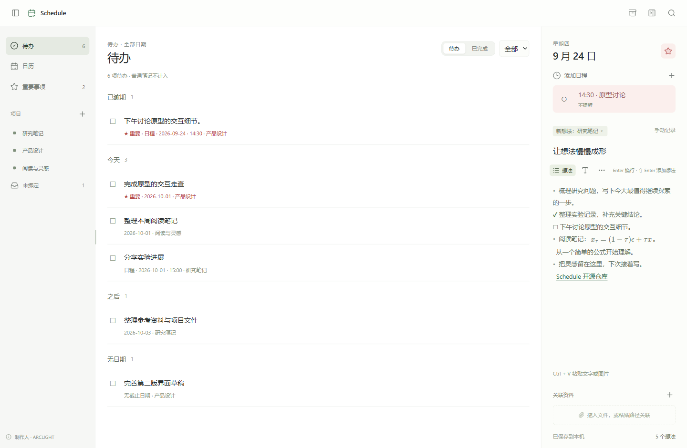

<p align="center"></p>
<h1 align="center">Schedule</h1>
<p align="center"><b>A place for today's ideas.</b></p>
<p align="center">A lightweight Windows calendar journal. Capture ideas, connect projects, and keep your files where they belong.</p>
<p align="center"><a href="README.md">简体中文</a> · <b>English</b></p>
<p align="center">
  <a href="https://github.com/ARC0127/Schedule/releases/tag/v0.0.6">Download v0.0.6</a> ·
  <a href="docs/releases/0.0.6.md">Release notes</a> ·
  <a href="https://arc0127.github.io/">ARCLIGHT</a> · <a href="LICENSE">MIT</a>
</p>


<p align="center"><sub>Interface preview with synthetic demo data. The desktop app launches directly; no localhost server is required.</sub></p>

## v0.0.6 · From ideas to done

Keep ordinary notes in your journal and turn them into tasks when action is needed. Importance, deadlines and linked events belong to one item. Complete it once and every view follows.

- **Focus on a day:** double-click a date to expand it, with text styling and links available while writing.
- **See what comes next:** pending and completed views, with ordinary, important and scheduled task filters.
- **Keep your work safe:** daily snapshots, restore previews, complete backups and a local API for Codex / Claude Code.

<details>
<summary>See the updated Todo overview</summary>



</details>

## See your days. Keep your ideas together.

| | What Schedule offers |
| --- | --- |
| **A calendar of progress** | Monthly and yearly views shade days in green by the number of meaningful ideas, normalized within the visible date range. Important items have reddish markers. |
| **Simple writing** | Enter adds a line; Shift+Enter adds an idea. Paste text or images and mark ideas complete. |
| **Projects across dates** | Link an idea to multiple projects. Open a project in the sidebar to see its ideas across dates, or use the dedicated unbound view. Overviews display images and open web links and shared day-level attachments. |
| **Local files, connected** | Drop files or folders, or paste paths. Files stay in their original locations and open directly from the desktop app. |
| **Windows reminders** | Multiple events per day, each with its own time, reminder, importance and completion state. |
| **Recoverable data** | Daily snapshots, manual backups, restore previews, complete portable backups and Markdown with images. |
| **Assistant integration** | Codex and Claude Code share a local CLI and skill with revision-checked writes. |
| **Within reach** | A transparent floating desktop icon, hover preview for today, click to restore, system tray, and optional startup at sign-in. |

## Download and start

1. Download **`Schedule-0.0.6-windows-x64.zip`** from the [v0.0.6 release](https://github.com/ARC0127/Schedule/releases/tag/v0.0.6).
2. Extract the entire archive into a fixed, writable folder.
3. Double-click **`Journal.exe`**. Its display name is **Schedule**. No installer is needed; the executable name is retained for existing shortcut and notification compatibility.

Requires **Windows 10/11 x64**, **.NET Framework 4.8**, and the [Microsoft Edge WebView2 Runtime](https://developer.microsoft.com/microsoft-edge/webview2/). Python, Node.js, and development tools are not needed to run the package.

> Choose the Windows ZIP to run the app. GitHub's automatic “Source code” downloads contain source files. The executable is currently unsigned, so Windows may display a publisher verification prompt.

## Everyday controls

| Action | How |
| --- | --- |
| Write for a day | Select a date and type in the editor on the right; clicking a muted adjacent-month date switches to that month and opens the selected day |
| Expand a day | Double-click a date to use both the calendar and editor area; use the back arrow or Esc to return. Single-click still selects the day |
| View important days | Open Important in the sidebar to list starred dates across all months. Click a row to expand that day; the back arrow or Esc returns to the list |
| Add an idea | **Shift+Enter**; **Enter** only adds a line |
| Choose projects | Select projects before adding an idea, or edit the current idea's bindings later |
| Mark complete | Place the caret inside an idea and **tap Ctrl alone** to complete it; tap again to return it to Todo. Ordinary notes can also be completed directly; Ctrl+C/V do not trigger completion |
| Insert an image | **Ctrl+V** in the editor |
| Format text | Select text to reveal formatting, or use the type icon to open it for future typing. Supports size, bold, italic, underline, color and clear formatting; **Ctrl+B / I / U** toggle bold / italic / underline |
| Write math | Use `\(...\)`, `\[...\]`, or `$$...$$`; focus the editor to edit TeX and leave it to see rendered equations, also shown in project overviews |
| Add an event | Use the clock / add-event control beneath the date |
| Idea actions | Place the caret in an idea and open **…** to select ordinary note / todo / completed, manage projects, importance and deadlines, link a schedule or delete the idea |
| Todo overview | Switch between pending and completed, and filter all / ordinary / important / scheduled tasks. Pending items are grouped by overdue, today, later and no date, with important items first within each group. Ordinary notes stay out of the list |
| Undo an action | Deleting an idea, changing its projects or toggling idea/event completion offers Undo for 10 seconds. Conflicting later edits are never overwritten; text editing still supports Ctrl+Z |
| Resume browsing | Project and search views remember their own page and scroll position. Sidebar width, visibility and the expanded-day layout are saved across restarts |
| Global search | Search text, projects, events and resources across all dates; open a result to reach its idea |
| Backups and exports | Open Data and backups using the archive icon in the top bar; preview differences before confirming a restore |
| Float on the desktop | Use the floating-icon control in the top bar; hover to preview today and click to restore |
| Tray and exit | Closing the main window sends it to the tray; use Exit in the tray menu to stop the app |
| Resize the sidebar | Drag the divider between the sidebar and content |

HTTP/HTTPS URLs, Markdown web links and Windows paths are recognized in both the editor and overviews. **Ctrl+click** opens a link while editing; after leaving the editor, a normal click opens it. Markdown links retain their source while editing and display their label while reading. Quote paths containing spaces. The daily resources section belongs to the date record and is shared across that day’s project views.

Pasting multiline text or equations keeps them in the current idea, including blank lines. Use Shift+Enter to add the next idea. Math renders offline; saving and copying retain the original TeX source.

New ideas start as ordinary notes. Mark one as a task to add importance or a linked schedule. Events can link to ideas from any date and follow that idea's completion; Todo shows one item for the idea and its linked events. Completing it from the calendar, project or event synchronizes the other views and cancels linked reminders. Converting it back to a note clears its deadline and detaches events, retaining them as standalone events. Existing checked ideas migrate to completed tasks; existing task flags and deadlines remain todos.

Text styles persist with each record and appear in project overviews and expanded day views. Copying within the app preserves styles, while plain-text copying retains the source text. These features are included in the v0.0.6 Windows download.

The desktop app opens today's date on startup. Midnight, tray restoration, and wake-up refresh the current day. An idle view of today follows the new day; active editing and historical-date browsing stay on their selected date. The Today button always reads the current system date.

Moving the window between monitors with different scaling settings redraws text and controls at the current monitor's DPI. The floating icon and today preview follow the monitor's scale as well.

## Your data stays on your computer

Data is stored in `%USERPROFILE%\.schedule\journal.json`, including journal text, ideas, project bindings, images, events, and floating-window position. Linked files remain at their original paths. Saves use a temporary file and atomic replacement; `.bak` holds the preceding version.

On first upgrade, legacy AppData and MSIX package-cache journals are backed up under `legacy-backups` before importing the populated copy. Different populated histories produce a visible conflict instead of an overwrite. Original files remain untouched; an existing new journal is never reimported. The new location avoids AppData redirection splitting desktop and Codex launches.

**Back up:** Exit from the tray, then copy the entire `%USERPROFILE%\.schedule` folder.

The Data and backups dialog also provides automatic daily snapshots (up to 30), retained manual snapshots and previews before restoring. Restore replaces all journal data, projects, images and events after preserving the current version. Windows reminders are reconciled after restore and still depend on notification permissions.

A complete ZIP contains the full JSON store and embedded images for import on another computer. Linked external files are referenced by path, not copied. Markdown ZIPs contain dated documents, events, completion, projects, deadlines and image files for reading. Use the complete backup to retain text formatting and internal IDs exactly. Importing a `.md` file appends it to the selected day, recognizes bullets/task checkboxes and loads local images referenced within its directory.

## Codex and Claude Code

Both use the same Windows CLI, without localhost or an additional runtime. `Schedule.Cli.exe` starts a tray process when needed and reads current GUI content. Writes require the `revision` returned by a read; stale revisions are rejected.

From the new application directory, install the skill for both assistants:

```powershell
powershell -NoProfile -File .\Install-AssistantSkills.ps1 -AppDirectory . -Target Both
```

Existing skills with the same name are preserved unless you explicitly use `-Force`, which first backs them up. Invoke `$schedule-local` in Codex or `/schedule-local` in Claude Code. You can also run `Schedule.Cli.exe --request request.json` with a UTF-8 JSON request, such as `{"op":"get_day","date":"2026-10-01"}`. See the [API reference](integrations/schedule-local/references/api.md). WSL sessions need Windows PowerShell access to this Windows executable.

**Upgrade:** Exit and back up first, then extract the new package over the existing program folder. Keeping the executable location and data folder preserves existing shortcuts and Windows notification identity. Legacy `points` / `newPointProjects` fields migrate to `ideas` / `newIdeaProjects`, retaining IDs, text, project bindings, and completion state.

## Build from source

On Windows, install Python 3.10+ and run:

```powershell
py -3 scripts/build.py
.\dist\Schedule\Journal.exe
```

The first build downloads pinned NuGet dependencies and uses the .NET Framework compiler included with Windows. Rust and the .NET SDK are not required. To create the distribution archive:

```powershell
py -3 scripts/package_release.py
```

The output is `dist/Schedule-0.0.6-windows-x64.zip`. It includes the app, both READMEs, the home screenshot, licenses, and the notes for this release.

Development tests also require Node.js and npm:

```powershell
npm ci
npm test
npm run test:native
npm run test:overview
npm run test:restart
npm run test:math
npm run test:calendar
npm run test:day-view
npm run test:important
npm run test:core
npm run test:cli
npm run test:usability
npm run test:tasks
npm run test:editor-links-dpi
npm run test:math-svg
py -3 scripts/test_native_models.py
```

Native tests require a desktop session and WebView2, and set an isolated data directory before process startup. CI runs state migration tests and a Windows build. The release workflow builds from the `v0.0.6` tag and publishes using the [versioned release notes](docs/releases/0.0.6.md).

Each document load reads the current file before enabling editing. Failed reads block editing, stale saves reject external file changes, and unchanged saves preserve the previous backup.

## Current scope

The interface is currently Chinese and storage remains single-user JSON. Assistants communicate with the desktop process through the local CLI; remote network writes and direct edits to the live journal file are unsupported. Markdown is a readable export, while complete backups preserve the full data model. Windows notification settings, Do Not Disturb, shutdown and sleep can affect reminder delivery.

## Creator and license

Made by [**ARCLIGHT**](https://arc0127.github.io/) and released under the [MIT License](LICENSE). Report problems through [Issues](https://github.com/ARC0127/Schedule/issues).

[Architecture and data model (Chinese)](docs/architecture.md) · [Third-party notices](THIRD_PARTY_NOTICES.md) · [v0.0.6 release notes](docs/releases/0.0.6.md)
