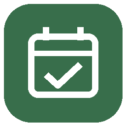
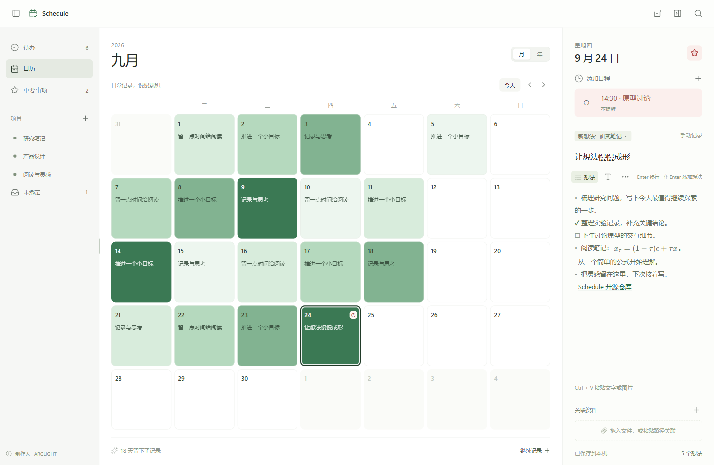

<p align="center"></p>
<h1 align="center">Schedule</h1>
<p align="center"><b>把想法留在今天。</b></p>
<p align="center">一个轻量的 Windows 本地日历日志。记录想法，关联项目，把资料留在原来的位置。</p>
<p align="center"><b>简体中文</b> · <a href="README.en.md">English</a></p>
<p align="center">
  <a href="https://github.com/ARC0127/Schedule/releases/tag/v0.0.3">下载 v0.0.3</a> ·
  <a href="docs/releases/0.0.3.md">版本说明</a> ·
  <a href="https://arc0127.github.io/">ARCLIGHT</a> · <a href="LICENSE">MIT</a>
</p>




<p align="center"><sub>使用演示数据的界面预览。桌面版直接打开，无需启动 localhost 服务。</sub></p>

## 一眼看见日常，一处收好想法

| | Schedule 可以做什么 |
| --- | --- |
| **日历里的积累** | 月历与年度热力图按有效想法数量显示绿色深浅，在当前显示范围内归一化。重要事项用偏红色标记。 |
| **轻松记录** | Enter 换行，Shift+Enter 添加想法。直接粘贴文字或图片，用完成状态记录进展。 |
| **跨项目整理** | 每个想法可关联多个项目。点击左侧项目查看不同日期的想法，也有独立的“未绑定”入口。总览直接显示图片，可打开网页链接与按天共享的关联资料。 |
| **连接本地资料** | 拖入文件或文件夹，或粘贴路径。资料保留在原位置，可从桌面版直接打开。 |
| **及时提醒** | 每天一条日程，可设置时间和提前提醒，通过 Windows 通知投递。重要标记与提醒分别设置。 |
| **随手可见** | 透明桌面悬浮图标、悬停查看今天、点击恢复主窗口，以及托盘和可选开机启动。 |

## 下载与开始

1. 在 [v0.0.3 发布页](https://github.com/ARC0127/Schedule/releases/tag/v0.0.3) 下载 **`Schedule-0.0.3-windows-x64.zip`**。
2. 将压缩包完整解压到一个固定、可写的文件夹。
3. 双击 **`Journal.exe`**，窗口和应用显示名为 **Schedule**。程序无需安装，保留此文件名用于兼容已有快捷方式和通知身份。

支持 **Windows 10/11 x64**，需要 **.NET Framework 4.8** 和 [Microsoft Edge WebView2 Runtime](https://developer.microsoft.com/microsoft-edge/webview2/)。运行下载包无需 Python、Node.js 或开发工具。

> 下载 Windows 压缩包即可运行；GitHub 自动生成的 “Source code” 是源码。当前程序未做代码签名，Windows 可能显示发布者验证提示。

## 最常用的操作

| 操作 | 用法 |
| --- | --- |
| 写当天记录 | 点击日历中的日期，在右侧输入 |
| 添加想法 | **Shift+Enter**；**Enter** 只换行 |
| 选择项目 | 添加前选择“新想法”的项目，也可稍后修改当前想法的绑定 |
| 标记完成 | 光标位于某个想法中，**单按 Ctrl** 切换完成；Ctrl+C/V 不会误触 |
| 插入图片 | 在编辑区 **Ctrl+V** |
| 添加日程 | 点击日期下方的时钟或“添加日程”入口 |
| 桌面悬浮 | 点击顶栏的悬浮入口按钮；靠近查看今天，点击回到主窗口 |
| 托盘与退出 | 关闭主窗口会收至托盘；在托盘菜单中选择退出才会结束程序 |
| 调整侧栏 | 拖动左侧栏与内容区之间的分隔线 |

总览中的 HTTP/HTTPS 网址和 Markdown 网页链接可直接打开。正文中的 Windows 路径也可点击，含空格时请用双引号括起。“当天资料”属于该日期的记录，由这一天的项目总览共享。

## 你的数据，留在本机

数据保存在 `%LOCALAPPDATA%\CodexJournal\journal.json`，包含正文、想法、项目关系、图片、日程与悬浮位置。关联的文件仍留在原路径。保存采用临时文件和原子替换，`.bak` 保存上一版。界面每次加载都会重新读取文件，读取失败时禁止编辑。保存前检查文件是否已被修改，过期状态不会覆盖磁盘内容；未变化的保存不会轮换备份。

**备份：** 从托盘退出程序，再复制整个 `%LOCALAPPDATA%\CodexJournal` 文件夹。

**升级：** 先退出并备份，将新版解压到原程序文件夹，覆盖程序文件。保留原安装位置与数据目录，可以继续使用已有快捷方式和 Windows 提醒身份。旧版 `points` / `newPointProjects` 字段会迁移为 `ideas` / `newIdeaProjects`，保留原 ID、正文、项目关系和完成状态。

## 从源码构建

在 Windows 上安装 Python 3.10+，运行：

```powershell
py -3 scripts/build.py
.\dist\Schedule\Journal.exe
```

首次构建联网下载固定版本的 NuGet 依赖，使用 Windows 自带的 .NET Framework 编译器。无需 Rust 或 .NET SDK。生成正式压缩包：

```powershell
py -3 scripts/package_release.py
```

输出为 `dist/Schedule-0.0.3-windows-x64.zip`，包含程序、中英文 README、首页图、许可证及本版发布说明。

开发测试另需 Node.js 与 npm：

```powershell
npm ci
npm test
npm run test:native
npm run test:overview
npm run test:restart
py -3 scripts/test_native_models.py
```

原生测试需要桌面会话和 WebView2，启动前设置独立数据目录。CI 执行状态迁移测试和 Windows 构建。发布流程从 `v0.0.3` 标签构建压缩包，并使用 [保存在仓库中的发布说明](docs/releases/0.0.3.md) 创建 Release。

## 当前边界

`0.0.3` 是重新加载与数据保存修复版本，界面目前为中文。数据使用单用户 JSON 存储，尚未实现 Markdown 导入导出、SQLite 或正式的 Codex skill/CLI 并发编辑接口。不要让外部工具覆盖运行中的日志文件。Windows 通知设置、免打扰、关机或休眠可能影响提醒投递。

## 开源与制作

由 [**ARCLIGHT**](https://arc0127.github.io/) 制作，使用 [MIT 许可证](LICENSE)。欢迎通过 [Issues](https://github.com/ARC0127/Schedule/issues) 反馈问题。

[架构与数据说明](docs/architecture.md) · [第三方许可](THIRD_PARTY_NOTICES.md) · [v0.0.3 发布说明](docs/releases/0.0.3.md)
